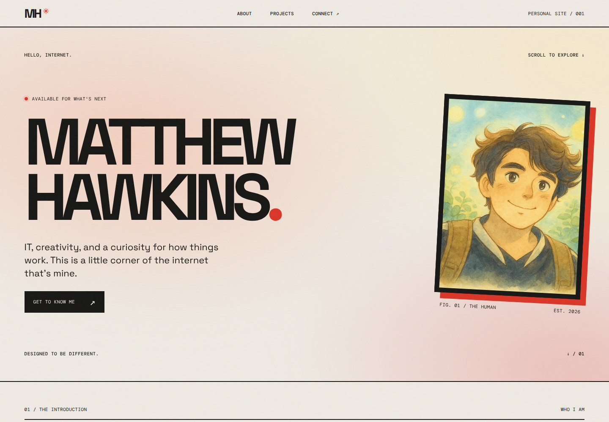
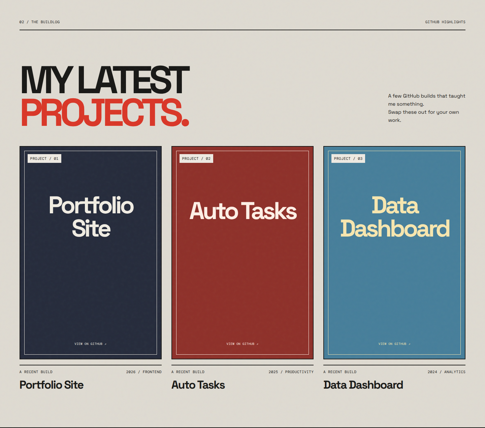
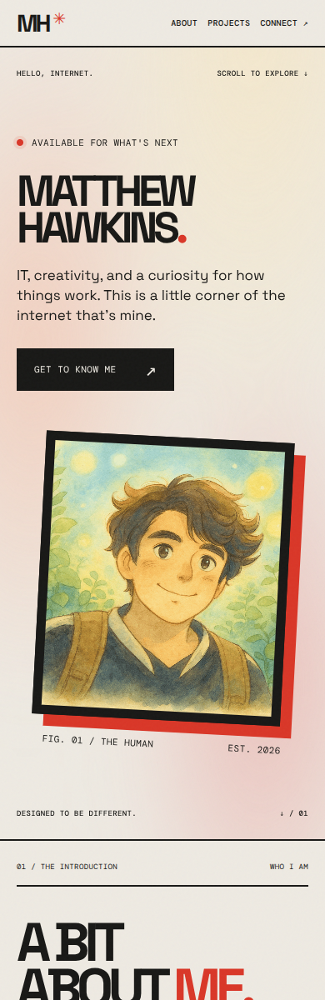

<div align="center">

**PERSONAL SITE / 001**

# MATTHEW HAWKINS ✳

### IT, creativity, and a curiosity for how things work.

A little corner of the internet that's mine.<br>
A personal portfolio built with bold type, paper tones, and a splash of red.

[](https://personal-page.thehawk6353.workers.dev/)
[](https://github.com/Matthew-Hawk/Personal-Page)



**HTML + CSS + JS. No build step.**

</div>

---

## 01 / The idea

A personal site with a little personality: warm cream backgrounds, charcoal text, red accents, a paper-grain overlay, and an animated glow behind the hero. It introduces the human behind the projects and leaves room for the site to grow.

This is a living project—part portfolio, part experiment, and a place to keep building.

## 02 / A look inside



<details>
<summary><strong>📱 See the mobile homepage</strong></summary>

<p align="center">

</p>

</details>

Screenshots were captured from a local run of the repository.

| Section | What's inside |
| :--- | :--- |
| **Hello, internet.** | Name, portrait, introduction, and a link to learn more |
| **A bit about me.** | A short bio and interests: technology, building, film, and curiosity |
| **My latest projects.** | Three configurable project cards generated with JavaScript |
| **Let's connect.** | Social links with hover effects |

### Small details, big character

- **Responsive layouts** that adapt the portrait, project grid, and social links for smaller screens.
- **Animated hero glow** and scroll reveals, with support for reduced-motion preferences.
- **Poster-style project cards** with configurable text, colors, and optional images.
- **Portrait fallback** that remains visible if the configured photo cannot load.
- **Keyboard focus styling**, labeled navigation, and descriptive image text.
- **Static files throughout**—no framework, dependency install, database, or build command.

> **Current content:** The project cards use sample entries and don't link to repositories yet, even though their artwork says “VIEW ON GITHUB.” The social links in `index.html` also contain placeholder usernames. See [Make it yours](#04--make-it-yours) to customize them.

## 03 / Run it locally

### Just want to see it?

Open the **[live website ↗](https://personal-page.thehawk6353.workers.dev/)**.

To view a downloaded copy, select **Code → Download ZIP** on [GitHub](https://github.com/Matthew-Hawk/Personal-Page), extract the whole folder, and open `index.html` in a modern browser. Keep the stylesheet, script, images, and favicon folder together.

### Prefer localhost?

You'll need [Python 3](https://www.python.org/downloads/), plus [Git](https://git-scm.com/downloads) if you want to clone rather than download the ZIP.

```sh
git clone https://github.com/Matthew-Hawk/Personal-Page.git
cd Personal-Page
```

**Windows — PowerShell or Command Prompt**

```powershell
py -m http.server 8000 --bind 127.0.0.1
```

**macOS / Linux — Terminal**

```sh
python3 -m http.server 8000 --bind 127.0.0.1
```

Visit **[http://localhost:8000](http://localhost:8000)**. Leave the terminal running while you browse; press **Ctrl+C** to stop the server.

If your Python installation uses `python`, use that in place of `py` or `python3`. If port `8000` is busy, use `8080` in both the command and the browser address.

**A note on fonts:** The site loads Space Grotesk and DM Mono from Google Fonts. Those fonts need an internet connection; fallback fonts are used when they're unavailable. Use localhost to preview the root-relative web manifest.

## 04 / Make it yours

| Change | Where to edit |
| :--- | :--- |
| Name, introduction, bio, and page metadata | `index.html` |
| LinkedIn, Instagram, and YouTube destinations | Social link `href` values in `index.html` |
| Portrait | `portfolio.profileImage` in `script.js` |
| Project titles, metadata, images, and card colors | `portfolio.projects` in `script.js` |
| Theme, typography, spacing, and motion | `style.css` |
| App name, theme, and icon paths | `site.webmanifest` |

### The palette

```css
--paper: #eeeae2;
--ink: #171715;
--red: #d93627;
```

### The project cards

Edit the `portfolio` object at the top of `script.js`. Each project supports these fields:

```js
{
  title: "My next build",
  detail: "2026 / FRONTEND",
  poster: "images/my-project.png",
  background: "#252b3b",
  ink: "#f1ede3"
}
```

Leave `poster` empty to use the styled text placeholder. Place custom images in `images/` and use their relative paths. To make a card open a repository, add a URL field and update the card-generation code to create an anchor; there is no project-link field wired up yet.

**Manifest icons:** The included icon images live in `Favicon/`. Update the manifest's icon paths to `/Favicon/web-app-manifest-192x192.png` and `/Favicon/web-app-manifest-512x512.png` when serving from the site root.

## 05 / Under the hood

| File / folder | Purpose |
| :--- | :--- |
| `index.html` | Single-page layout, content, navigation, and social links |
| `style.css` | Theme, responsive layouts, grain texture, and animations |
| `script.js` | Portrait loading, project-card rendering, scroll reveals, and current year |
| `images/` | Portrait and any added project images |
| `Favicon/` | Browser and app icon assets |
| `site.webmanifest` | Web app metadata |
| `docs/screenshots/` | Images used in this README |

### Hosting

The live site is available at **[personal-page.thehawk6353.workers.dev](https://personal-page.thehawk6353.workers.dev/)**. The repository contains static site files and no deployment configuration; there is no build command. To host a copy, serve `index.html`, `style.css`, `script.js`, `images/`, `Favicon/`, and `site.webmanifest` together from the site root.

---

<div align="center">

**✳ DESIGNED TO BE DIFFERENT.**

[Matthew Hawkins](https://github.com/Matthew-Hawk) · [Visit the site ↗](https://personal-page.thehawk6353.workers.dev/)

</div>
